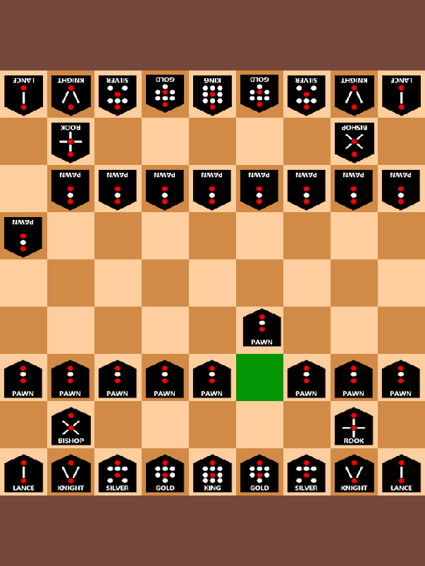

# shogi GUI

## Licence

This project is dual-licensed under zlib and GNU GPL v3 (recipients may choose to respect one or the other at their discretion)

(non usi compliant, works in tandem with michaelb/shogai. Other features may be considered)

This project is a fork of Arsukeey/chess, big thumbs up to him/her!

https://github.com/Arsukeey/chess.git

### Dependencies
 - SDL2
 - SDL_Image
 
 (usually available from your distribution's repositories)

## Gameplay

clone and then cargo run --release, or build (--release) and run the executable

To play against a stupid bot (hardcoded for now), you can:

- Click (it will be "picked" automatically) on the piece you want to move
- Put it at the desired location.

Illegal moves will be prevented
